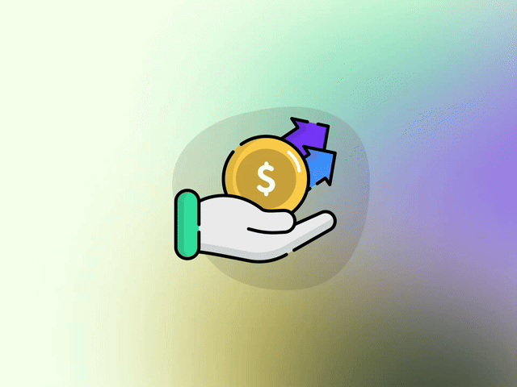

    

 
    

<h1 align="center">Hi 👋, I'm <a href="https://github.com/HowToRiseUp">Howie</a></h1>
<h5 align="center">A passionate web developer from Viet Nam</h5>

## What I'm Doing:

- 🌱 I’m currently learning: **Full Stack Development**
- 💬 Ask me about: **MERN Stack**
- 📫 How to reach me: **lenhathao01020@gmail.com**
- ⚡ Fun fact: **I think I am funny**
- 📄 Curriculum Vitae: **<a href="https://drive.google.com/file/d/1Z_OT_aY9h1cIIxvqSz57_KPIHiF34XeG/view" target="blank">VI</a>**

## Connect with me:

    
    

## Languages and Tools:

    

## Top Repositories:

    
    

## My Stats:

    

## Activity On GitHub:

    

## Profile Trophy:

    

## Most Used Languages:

    

